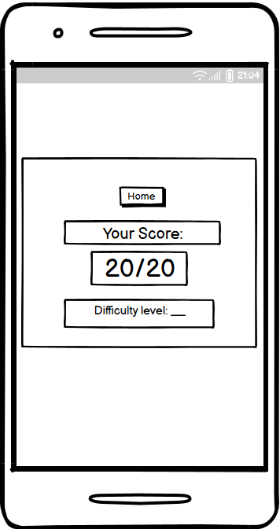
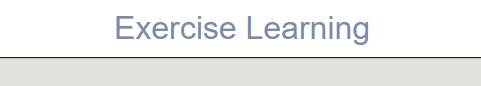
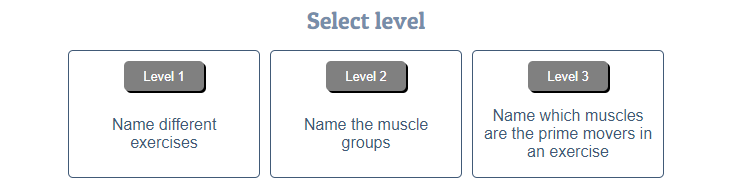
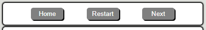
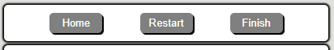
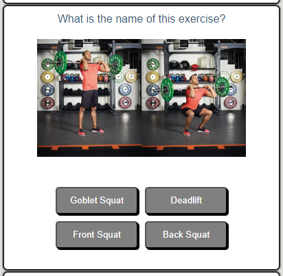
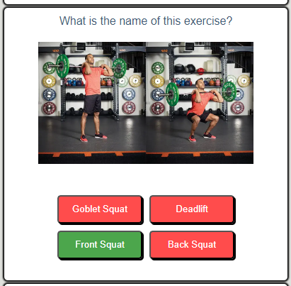
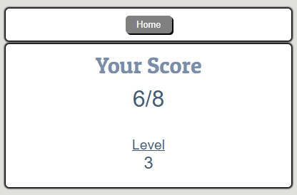

# [EXERCISE LEARNING](https://davidfb94.github.io/exercise-learning)

## Overview
Exercise Learning is a learning tool for anyone that wants to increase their knowledge about  
gym related exercise, and how it works the body.

Exercise Learning will quiz the user about strength training exercises, names for the muscles, and how each exercise targets different muscles.

The site allows the user to select a topic they are interested in. While in the quiz, the user gets instant feedback on their performance through the use of color and text.

This website was built as a project for the Diploma in Full Stack Software Development at Code Institute.

## Mock-up

## UX
I started out with Wireframes for both desktop and phone. 

After creating the basic structure for the different pages, the site felt a bit empty. I added a header and footer (with link to my GitHub) to fill out the top and bottom of the screen.

I also added a "your last performance" feature to the home page.

### Colour Scheme

I wanted the site to have a simple look, to let the user focus on the learning.

- `#778DA9 ` used for primary text.
- `#415A77` used for secondary text.

I used [coolors.co](https://coolors.co/000000-415a77-778da9-6b6a6a-e0e1dd-ffffff) to generate my colour palette.

### Typography

I used Google fonts for fonts import.

- [Patua One](https://fonts.google.com/specimen/Patua+One) was used for the primary headers and titles.

- Arial was used for all other secondary text.

## Wireframes
I've used [Balsamiq](https://balsamiq.com/wireframes) to design my site wireframes.

### Mobile Wireframes

 Click here to see the Mobile Wireframes 

Home
  - 

Quiz
  - 

Score-screen
  - 

### Desktop Wireframes

 Click here to see the Desktop Wireframes 

Home
  - 

Quiz
  - 

Score-screen
  - 

## Features

### Existing Features

- **Logo with home navigation**

    -   Adds maneuverability to the site.

- **Description section**

    -   Where the user can read a description of the purpose of the site, and the rules for the quizzes.

- **Levels section**

    - Where the user can read about the content of the quizzes, and select a level of their choosing.

- **Your last performance section**

    - Where the user can choose to show/hide their last performance.

- **Quiz controls**

    - Where the user can got back to home screen, reset the quiz, and go to the next question/ finish the quiz and go to the score screen.

- **Question and answer section**

    - Where the user can read the question and see the related images + select their answer and get color feedback based on correct/incorrect answer.

- **Tracking section**

    - Where the user can see their progress and score in the current quiz.

- **Score screen**

    - Where the user can see a score summary from the quiz they just completed and go back to the home screen.

- **Footer with GitHub link**

    - Where the user can get information about the developer, and find the developers GitHub link.

### Future Features

- Add feature for questions summary at score screen.
    - Display question +  answer as a list, to recap the level and find areas of improvement.

- Add page for quiz history/score/high-score

- Add additional quizzes/questions

## Tools & Technologies Used

- [HTML](https://en.wikipedia.org/wiki/HTML) used for the main site content.
- [CSS](https://en.wikipedia.org/wiki/CSS) used for the main site design and layout.
- [CSS Flexbox](https://www.w3schools.com/css/css3_flexbox.asp) used for an enhanced responsive layout.
- [CSS Grid](https://www.w3schools.com/css/css_grid.asp) used for an enhanced responsive layout.
- [JavaScript](https://www.javascript.com) used for user interaction on the site.
- [Git](https://git-scm.com) used for version control. (`git add`, `git commit`, `git push`)
- [GitHub](https://github.com) used for secure online code storage.
- [GitHub Pages](https://pages.github.com) used for hosting the deployed front-end site.
- [Gitpod](https://gitpod.io) used as a cloud-based IDE for development.
- [TinyPNG](https://tinypng.com) tool for image compression.
- [Pixelied](https://pixelied.com/convert/png-converter/png-to-webp) tool for image format conversion.

## Testing

For all testing, please refer to the [TESTING.md](TESTING.md) file.

## Deployment

The site was deployed to GitHub Pages. The steps to deploy are as follows:

- In the [GitHub repository](https://github.com/DavidFB94/exercise-learning), navigate to the Settings tab 
- From the source section drop-down menu, select the **Main** Branch, then click "Save".
- The page will be automatically refreshed with a detailed ribbon display to indicate the successful deployment.

The live link can be found [here](https://davidfb94.github.io/exercise-learning)

### Local Deployment

This project can be cloned or forked in order to make a local copy on your own system.

#### Cloning

You can clone the repository by following these steps:

1. Go to the [GitHub repository](https://github.com/DavidFB94/exercise-learning) 
2. Locate the Code button above the list of files and click it 
3. Select if you prefer to clone using HTTPS, SSH, or GitHub CLI and click the copy button to copy the URL to your clipboard
4. Open Git Bash or Terminal
5. Change the current working directory to the one where you want the cloned directory
6. In your IDE Terminal, type the following command to clone my repository:
	- `git clone https://github.com/DavidFB94/exercise-learning.git`
7. Press Enter to create your local clone.

Alternatively, if using Gitpod, you can click below to create your own workspace using this repository.

Please note that in order to directly open the project in Gitpod, you need to have the browser extension installed.
A tutorial on how to do that can be found [here](https://www.gitpod.io/docs/configure/user-settings/browser-extension).

#### Forking

By forking the GitHub Repository, we make a copy of the original repository on our GitHub account to view and/or make changes without affecting the original owner's repository.
You can fork this repository by using the following steps:

1. Log in to GitHub and locate the [GitHub Repository](https://github.com/DavidFB94/exercise-learning)
2. At the top of the Repository (not top of page) just above the "Settings" Button on the menu, locate the "Fork" Button.
3. Once clicked, you should now have a copy of the original repository in your own GitHub account!

### Local VS Deployment

No significant differences between local and deployed version.

## Credits

The basic structure for the quiz page was created following a YouTube tutorial (linked in ###content below). Most of the functions have been modified.

The incrementScore functions are borrowed from Code Institutes Love Maths project.

The remaining content was created by the developer, with the help of Code Institutes learning platform, my Code Institute mentor, w3schools.com and stackoverflow.com for general questions about code structure and syntax.

### Content

| Source | Location | Notes |
| --- | --- | --- |
| [YouTube](https://www.youtube.com/watch?v=riDzcEQbX6k&ab_channel=WebDevSimplified) | quiz page | basic structure for the quiz |
| [YouTube](https://www.youtube.com/watch?v=YL1F4dCUlLc&t=884s&ab_channel=WesBos) | entire site | tutorial for using `localStorage()` |
| [Markdown Builder](https://tim.2bn.dev/markdown-builder) | README and TESTING | tool to help generate the markdown files |
| [Stackedit](https://stackedit.io/) | README and TESTING | markdown editor |
| [W3Schools](https://www.w3schools.com/css/css3_flexbox.asp) | entire site | flex-box usage |
| [StackOverflow](https://stackoverflow.com/questions/9329446/loop-for-each-over-an-array-in-javascript) | quiz page | explaining `forEach()` function for creating buttons/checking answers loops |

### Media

| Source | Location | Type | Notes |
| --- | --- | --- | --- |
| [Istockphoto](https://www.istockphoto.com/se/foto/anatomy-muscles-gm160380572-22755945) | quiz | image | image of muscle anatomy used for displaying muscle groups (added lines for each image in paint) |
| [Myprotein](https://www.myprotein.com/thezone/training/the-deadlift-top-mistakes-and-reasons-for-lower-back-pain/) | quiz | image | image of deadlift |
| [Coachweb](https://www.coachweb.com/barbell-exercises/6705/how-to-master-the-barbell-back-squat) | quiz | image | image of back squat |
| [Coachweb](https://www.coachweb.com/leg-exercises/3379/how-to-master-the-goblet-squat) | quiz | image | image of goblet squat |
| [Coachweb](https://www.coachweb.com/exercises/chest-exercises/186/bench-press-technique-tips) | quiz | image | image of bench press |
| [Coachweb](https://www.coachweb.com/shoulder-exercises/6134/how-to-do-a-dumbbell-shoulder-press) | quiz | image | image of dumbbell shoulder press |
| [Coachweb](https://www.coachweb.com/exercises/arm-exercises/156/bench-dip) | quiz | image | image of dip |
| [Coachweb](https://www.coachweb.com/exercises/8648/cable-machine-exercises) | quiz | image | image of triceps pushdown |
| [Fontawesome](https://fontawesome.com/icons/leanpub?f=brands&s=solid) | entire site | image | favicon on all pages |
| [Fontawesome](https://fontawesome.com/icons/github?f=brands&s=solid) | entire site | image |  GitHub icon in footer on all pages |

### Acknowledgements

- I would like to thank my Code Institute mentor, [Tim Nelson](https://github.com/TravelTimN) for their support throughout the development of this project.
-   I would like to thank my wife Maria for believing in me, and allowing me to make this transition into software development.