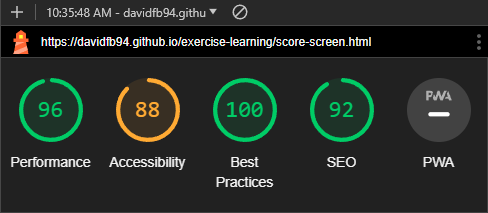

# Testing

Return back to the [README.md](README.md) file.

## Code Validation

### HTML

I have used the recommended [HTML W3C Validator](https://validator.w3.org) to validate all of my HTML files.

| Page | W3C URL | Screenshot | Notes |
| --- | --- | --- | --- |
| Home | [W3C](https://validator.w3.org/nu/?doc=https%3A%2F%2Fdavidfb94.github.io%2Fexercise-learning%2Findex.html) |  | Section lacks header h2-h6 warning and missing alt attribute for image (fixed).|
| Quiz | [W3C](https://validator.w3.org/nu/?doc=https%3A%2F%2FDavidFB94.github.io%2Fexercise-learning%2Fcontact.html) |  | Section lacks header h2-h6 warning |
| Score Screen | [W3C](https://validator.w3.org/nu/?doc=https%3A%2F%2Fdavidfb94.github.io%2Fexercise-learning%2Fscore-screen.html) |  | Pass: No Errors |

### CSS

I have used the recommended [CSS Jigsaw Validator](https://jigsaw.w3.org/css-validator) to validate all of my CSS files.

| File | Jigsaw URL | Screenshot | Notes |
| --- | --- | --- | --- |
| style.css | [Jigsaw](https://jigsaw.w3.org/css-validator/validator?uri=https%3A%2F%2Fdavidfb94.github.io%2Fexercise-learning%2F&profile=css3svg&usermedium=all&warning=1&vextwarning=&lang=en) |  | Pass: No Errors |

### JavaScript

I have used the recommended [JShint Validator](https://jshint.com) to validate all of my JS files.

| File | Screenshot | Notes |
| --- | --- | --- |
| index.js |  | Pass |
| questions.js |  | Unused variables, used in external file|
| score-screen.js |  | Pass |
| script.js |  | Undefined variables from external files |

## Browser Compatibility

I've tested my deployed project on multiple browsers to check for compatibility issues.

| Browser | Index | Quiz | Score screen | Notes |
| --- | --- | --- | --- | --- |
| Chrome |  |  |  | Works as expected |
| Edge|  |  |  | Works as expected |
| Firefox|  |  |  | Button styles slightly different |

## Responsiveness

I've tested my deployed project on multiple devices to check for responsiveness issues.

| Device | Index | Quiz | Score Screen | Notes |
| --- | --- | --- | --- | --- |
| Mobile (DevTools) |  |  |  | Works as expected |
| Tablet (DevTools) |  |  |  | Works as expected |
| Desktop |  |  |  | Works as expected |
| Sony Xperia 10 |  |  |  | Works as expected |

## Lighthouse Audit

I've tested my deployed project using the Lighthouse Audit tool to check for any major issues.

| Page | Mobile | Desktop | Notes |
| --- | --- | --- | --- |
| Home |  |  | Some minor warnings. Accessibility fixed. |
| Quiz |  |  | Some minor warnings. Accessibility fixed. |
| Score Screen |  |  | Some minor warnings. Accessibility fixed. |