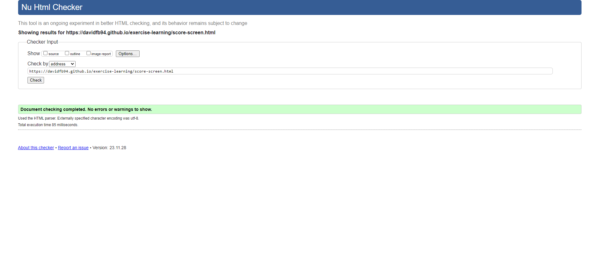
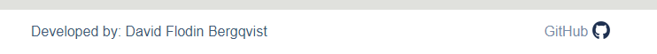

# Testing

Return back to the [README.md](README.md) file.

## Code Validation

### HTML

I have used the recommended [HTML W3C Validator](https://validator.w3.org) to validate all of my HTML files.

| Page | W3C URL | Screenshot | Notes |
| --- | --- | --- | --- |
| Home | [W3C](https://validator.w3.org/nu/?doc=https%3A%2F%2Fdavidfb94.github.io%2Fexercise-learning%2Findex.html) |  | Section lacks header h2-h6 warning and missing alt attribute for image (fixed).|
| Quiz | [W3C](https://validator.w3.org/nu/?doc=https%3A%2F%2FDavidFB94.github.io%2Fexercise-learning%2Fcontact.html) |  | Section lacks header h2-h6 warning |
| Score Screen | [W3C](https://validator.w3.org/nu/?doc=https%3A%2F%2Fdavidfb94.github.io%2Fexercise-learning%2Fscore-screen.html) |  | Pass: No Errors |

### CSS

I have used the recommended [CSS Jigsaw Validator](https://jigsaw.w3.org/css-validator) to validate all of my CSS files.

| File | Jigsaw URL | Screenshot | Notes |
| --- | --- | --- | --- |
| style.css | [Jigsaw](https://jigsaw.w3.org/css-validator/validator?uri=https%3A%2F%2Fdavidfb94.github.io%2Fexercise-learning%2F&profile=css3svg&usermedium=all&warning=1&vextwarning=&lang=en) |  | Pass: No Errors |

### JavaScript

I have used the recommended [JShint Validator](https://jshint.com) to validate all of my JS files.

| File | Screenshot | Notes |
| --- | --- | --- |
| index.js |  | Pass |
| questions.js |  | Unused variables, used in external file|
| score-screen.js |  | Pass |
| script.js |  | Undefined variables from external files |

## Browser Compatibility

I've tested my deployed project on multiple browsers to check for compatibility issues.

| Browser | Index | Quiz | Score screen | Notes |
| --- | --- | --- | --- | --- |
| Chrome |  |  |  | Works as expected |
| Edge|  |  |  | Works as expected |
| Firefox|  |  |  | Button styles slightly different |

## Responsiveness

I've tested my deployed project on multiple devices to check for responsiveness issues.

| Device | Index | Quiz | Score Screen | Notes |
| --- | --- | --- | --- | --- |
| Mobile (DevTools) |  |  |  | Works as expected |
| Tablet (DevTools) |  |  |  | Works as expected |
| Desktop |  |  |  | Works as expected |
| Sony Xperia 10 |  |  |  | Works as expected |

## Lighthouse Audit

I've tested my deployed project using the Lighthouse Audit tool to check for any major issues.

| Page | Mobile | Desktop | Notes |
| --- | --- | --- | --- |
| Home |  |  | Some minor warnings. Accessibility fixed. |
| Quiz |  |  | Some minor warnings. Accessibility fixed. |
| Score Screen |  |  | Some minor warnings. Accessibility fixed. |

## Defensive Programming

Defensive programming was manually tested with the below user acceptance testing:

| Page | Expectation | Test | Result | Fix | Screenshot |
| --- | --- | --- | --- | --- | --- |
| Index | | | | | |
| | Feature is expected to direct the user to index-page when clicked | Tested the feature by clicking | The feature behaved as expected, I got directed to index-page | Test concluded and passed |  |
| | Feature is expected to take the user to the selected level when the button is clicked | Tested the feature clicking the buttons | The feature behaved as expected, I got directed to the selected quiz | Test concluded and passed |  |
| | Feature is expected to show/hide the last performance box when the button is pressed | Tested the feature clicking the button | The feature behaved as expected, it toggled the last performance box | Test concluded and passed |   |
| Quiz | | | | | |
| | Feature is expected to let the user go back to home page, reset the current quiz, move on to the next question/end the game when an answer has been selected, on button click | Tested the feature by clicking the buttons, and trying to go to next question/end game before I had selected an answer | The feature behaved as expected, the home button redirected me to index-page, reset button restarted the current quiz, and I could not press next/finish until an answer has been selected | Test concluded and passed |  |
| | Feature is expected to show a question + image in a randomized order, with answer buttons for each question | Tested the feature by running and completing 2 quizzes | The feature behaved as expected, I was shown a question + image in a randomized order | Test concluded and passed |  |
| | Feature is expected to display the correct/wrong answers with color feedback | Tested the feature by selecting correct and wrong answers in a quiz | The feature behaved as expected, the correct answer turned green, while the incorrect answers turned red | Test concluded and passed |  |
| | Feature is expected to track and display the users progress | Tested the feature by running a quiz | The feature behaved as expected, the progress was tracked and displayed | Test concluded and passed |  |
| Score Screen | | | | | |
| | Feature is expected to display a summary of the quiz, and let the user go back to the index-page when the "home" button is clicked. It also stores the progress in localStorage() for use in the index-page | Tested the feature by completing a quiz, and clicking the "home" button | The feature behaved as expected, it displayed a summary of my score, the "home" button returned me to the index-page, and the score was tracked in the last performance box | Test concluded and passed |  |
| | Feature is expected to redirect the user to GitHub (in a new page) when the link is pressed | Tested the feature by pressing the link | The feature behaved as expected, it opened the GitHub profile in a new tab | Test concluded and passed |  |